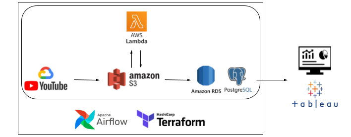

# Youtube Comments ETL Pipeline

## Processing text data from the Youtube API while applying sentiment analysis on comments

This ETL pipeline extracts Youtube comments relevant to the provided channel, transforms the data through AWS Lambda and loads stage data into an AWS RDS instance PostgreSQL database.

Concluded with data visualization done in Tableau dashboard.


## Table of Contents

- [Architecture](##architecture)
    * [Technologies](###technologies)
    * [DAG Task Summary](###dag-task-summary)
- [Requirements](##requirements)
- [Usage](##usage)
- [Example Dashboard (Ex. Youtube Channel: Jubliee)](##example-dashboard)


## Architecture


### Technologies
- [Airflow](https://airflow.apache.org/) as orchestration (v2.5.0)
- [Terraform](https://www.terraform.io/) for provisioning infrastructure
- [AWS S3](https://aws.amazon.com/s3/) as storage for raw and stage data
- [AWS Lambda](https://aws.amazon.com/lambda/) for data processing
- [AWS RDS](https://aws.amazon.com/rds/) instance establishes PostgreSQL database
- [Tableau](https://www.tableau.com/) for dashboarding

### DAG Task Summary
0. Add configuration.env as Airflow variables (all key-value pairs from terraform outputs)
1. Connect Airflow with AWS
2. Call the Youtube API (specifically: https://www.googleapis.com/youtube/v3/commentThreads) and uploading as raw data (json) to S3 bucket. Creates directory: raw/
3. Generate a CREATE SQL script for provided channel
4. Invoke AWS Lambda to transform raw data into stage data (checks for duplicates, null values, performs sentiment analysis). Creates directory: stage/
5. Check if stage data exists in S3
6. Connect Airflow with the AWS RDS instance
7. Run the CREATE SQL script for PostgreSQL DB: youtube_comment_db (table is named youtube_{channel_name}_data)
8. Load stage data from S3 to youtube_comment_db
9. Generate a ALTER SQL script
10. Run the ALTER SQL script


## Requirements
- [Docker](https://www.docker.com/) with 4 GB of memory and [Docker-Compose](https://docs.docker.com/compose/) v1.29.1 [Needed for Airflow v2.5.0]
- Install and configure [AWS CLI](https://aws.amazon.com/cli/)
- Install and configure [Google Cloud CLI (gcloud)](https://cloud.google.com/sdk/gcloud)
    * Create API key on [Google Cloud Console](https://console.cloud.google.com/) with access to "Youtube Data API v3"
- [Terraform](https://www.terraform.io/) for creating AWS infrastructure

## Usage

**Start Pipeline**
1. `make airflow-up` - initialize Airflow database migrations and start Airflow
2. `make zip` - create AWS Lambda Layer via zip file of requirement.txt
3. `make infra-up` - initialize and apply infrastructure using Terraform (type "yes" when prompted)
4. `make config` - generate key-value pairs for configuration.env
5. Run Airflow DAG

\
**Stop Pipeline**
1. `make infra-down` - destroy infrastructure
2. `make airflow-down` - stop Airflow by deleting containers

## Example Dashboard
### Channel Example: Jubilee
```python
# Provide channel_link, the infix for the name of your table in RDS postgres and max amount of comments [max 100]
# (table name will be formatted to be PostgreSQL friendly, see SQL directory)
provide_channel_name = 'https://www.youtube.com/channel/UCJjSDX-jUChzOEyok9XYRJQ'
provide_table_infix = 'Jubilee'
provide_num_of_comments = 100 
```

[Link to Public Tableau Dashboard](https://public.tableau.com/app/profile/jayden.dayno6022/viz/JubileeDashboard/CurrentData)


